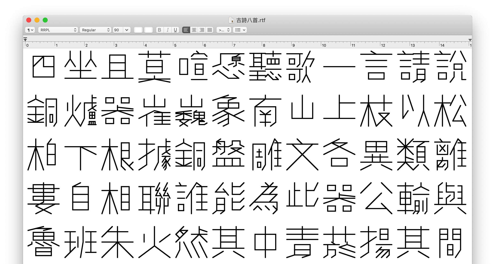
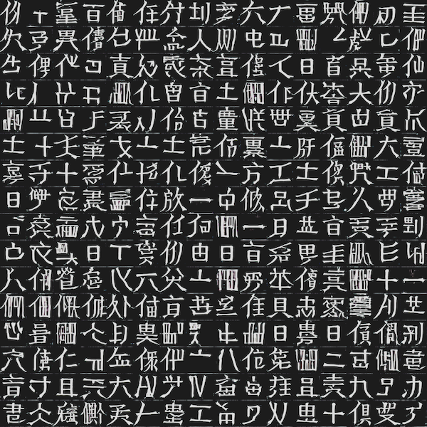

# Recursive Radical Packing Language

Recursive Radical Packing Language (RRPL) is a proposal for a method of describing arbitrary Chinese characters concisely while retaining their structural information. Potential fields for usage include font design and machine learning. In RRPL, each Chinese character is described as a short string of numbers, symbols, and references to other characters. Its syntax is inspired by markup languages such as LaTeX, as well as the traditional "米" grids used for calligraphy practice.


**5000+** Traditional Chinese Characters and radicals are currently described using this lanugae. You can download a .json file containing all of them (and unicode mapping) here: [dist/min-trad.json](./dist/min-trad.json)

## Syntax

Each Chinese character is described as a combination of components. These components can be other characters or radicals, as well as *building blocks*, which defines the simplest shapes that make up every component. Combination can be applied recursively to describe ever more complex glyphs.

Below is an overview of this syntax; You can also **check out the [Interactive Demo](https://lingdong-.github.io/rrpl/)** to play with it yourself.

### Building Blocks

A building block is a string of the alphabet {`0`, `1`, `2`, `3`, `4`, `5`, `6`, `7`, `8`}, in which the presence of a number indicates a corresponding stroke to be drawn on a "米" grid:

```
 1 2 3
  \|/
8 -+- 4
  /|\
 7 6 5
```
`0` indicates that no stroke should be drawn in this block.

**Example:**
<table>
<tr><th>Result</th><th>Code</th><th>Result</th><th>Code</th><tr>
<tr>
<td></td><td><code>48</code></td>
<td><svg xmlns='http://www.w3.org/2000/svg' width='128' height='128'><g stroke='#EDEDED' stroke-width='3'><line x1='14' y1='14' x2='64' y2='64'/>,<line x1='64' y1='14' x2='64' y2='64'/>,<line x1='114' y1='14' x2='64' y2='64'/>,<line x1='114' y1='64' x2='64' y2='64'/>,<line x1='114' y1='114' x2='64' y2='64'/>,<line x1='64' y1='114' x2='64' y2='64'/>,<line x1='14' y1='114' x2='64' y2='64'/>,<line x1='14' y1='64' x2='64' y2='64'/></g><g stroke='black' stroke-width='3'><line x1='64' y1='14' x2='64' y2='64'/>,<line x1='114' y1='64' x2='64' y2='64'/>,<line x1='114' y1='114' x2='64' y2='64'/>,<line x1='14' y1='114' x2='64' y2='64'/>,<line x1='14' y1='64' x2='64' y2='64'/></g></svg></td><td><code>24578</code></td>
</tr>
</table>

### Packing

Building blocks can be packed horizontally or vertically using the `-` and `|` symbols respectively to compose more complex glyphs. These symbols can be chained to pack more than two symbols with equal room.

**Example:**
<table>
<tr><th>Result</th><th>Code</th><th>Result</th><th>Code</th><tr>
<tr>
<td><svg xmlns='http://www.w3.org/2000/svg' width='128' height='128'><g stroke='#EDEDED' stroke-width='3'><line x1='81' y1='14' x2='97' y2='64'/>,<line x1='97' y1='14' x2='97' y2='64'/>,<line x1='114' y1='14' x2='97' y2='64'/>,<line x1='114' y1='64' x2='97' y2='64'/>,<line x1='114' y1='114' x2='97' y2='64'/>,<line x1='97' y1='114' x2='97' y2='64'/>,<line x1='81' y1='114' x2='97' y2='64'/>,<line x1='81' y1='64' x2='97' y2='64'/>,<line x1='47' y1='14' x2='64' y2='64'/>,<line x1='64' y1='14' x2='64' y2='64'/>,<line x1='81' y1='14' x2='64' y2='64'/>,<line x1='81' y1='64' x2='64' y2='64'/>,<line x1='81' y1='114' x2='64' y2='64'/>,<line x1='64' y1='114' x2='64' y2='64'/>,<line x1='47' y1='114' x2='64' y2='64'/>,<line x1='47' y1='64' x2='64' y2='64'/>,<line x1='14' y1='14' x2='31' y2='64'/>,<line x1='31' y1='14' x2='31' y2='64'/>,<line x1='47' y1='14' x2='31' y2='64'/>,<line x1='47' y1='64' x2='31' y2='64'/>,<line x1='47' y1='114' x2='31' y2='64'/>,<line x1='31' y1='114' x2='31' y2='64'/>,<line x1='14' y1='114' x2='31' y2='64'/>,<line x1='14' y1='64' x2='31' y2='64'/></g><g stroke='black' stroke-width='3'><line x1='97' y1='14' x2='97' y2='64'/>,<line x1='97' y1='114' x2='97' y2='64'/>,<line x1='64' y1='14' x2='64' y2='64'/>,<line x1='64' y1='114' x2='64' y2='64'/>,<line x1='31' y1='14' x2='31' y2='64'/>,<line x1='14' y1='114' x2='31' y2='64'/></g></svg></td><td><code>27-26-26</code></td>
<td><svg xmlns='http://www.w3.org/2000/svg' width='128' height='128'><g stroke='#EDEDED' stroke-width='3'><line x1='14' y1='64' x2='64' y2='89'/>,<line x1='64' y1='64' x2='64' y2='89'/>,<line x1='114' y1='64' x2='64' y2='89'/>,<line x1='114' y1='89' x2='64' y2='89'/>,<line x1='114' y1='114' x2='64' y2='89'/>,<line x1='64' y1='114' x2='64' y2='89'/>,<line x1='14' y1='114' x2='64' y2='89'/>,<line x1='14' y1='89' x2='64' y2='89'/>,<line x1='14' y1='14' x2='64' y2='39'/>,<line x1='64' y1='14' x2='64' y2='39'/>,<line x1='114' y1='14' x2='64' y2='39'/>,<line x1='114' y1='39' x2='64' y2='39'/>,<line x1='114' y1='64' x2='64' y2='39'/>,<line x1='64' y1='64' x2='64' y2='39'/>,<line x1='14' y1='64' x2='64' y2='39'/>,<line x1='14' y1='39' x2='64' y2='39'/></g><g stroke='black' stroke-width='3'><line x1='64' y1='64' x2='64' y2='89'/>,<line x1='114' y1='89' x2='64' y2='89'/>,<line x1='114' y1='114' x2='64' y2='89'/>,<line x1='14' y1='114' x2='64' y2='89'/>,<line x1='14' y1='89' x2='64' y2='89'/>,<line x1='64' y1='14' x2='64' y2='39'/>,<line x1='114' y1='39' x2='64' y2='39'/>,<line x1='64' y1='64' x2='64' y2='39'/>,<line x1='14' y1='39' x2='64' y2='39'/></g></svg></td><td><code>2468|24578</code></td>
</tr>
</table>

### Grouping

`(` and `)` symbols can be used to group components together so mixed horizontal and vertical packing can happen in the correct order.

**Example:**
<table>
<tr><th>Result</th><th>Code</th><th>Result</th><th>Code</th><tr>
<tr>
<td><svg xmlns='http://www.w3.org/2000/svg' width='128' height='128'><g stroke='#EDEDED' stroke-width='3'><line x1='81' y1='64' x2='97' y2='89'/>,<line x1='97' y1='64' x2='97' y2='89'/>,<line x1='114' y1='64' x2='97' y2='89'/>,<line x1='114' y1='89' x2='97' y2='89'/>,<line x1='114' y1='114' x2='97' y2='89'/>,<line x1='97' y1='114' x2='97' y2='89'/>,<line x1='81' y1='114' x2='97' y2='89'/>,<line x1='81' y1='89' x2='97' y2='89'/>,<line x1='81' y1='14' x2='97' y2='39'/>,<line x1='97' y1='14' x2='97' y2='39'/>,<line x1='114' y1='14' x2='97' y2='39'/>,<line x1='114' y1='39' x2='97' y2='39'/>,<line x1='114' y1='64' x2='97' y2='39'/>,<line x1='97' y1='64' x2='97' y2='39'/>,<line x1='81' y1='64' x2='97' y2='39'/>,<line x1='81' y1='39' x2='97' y2='39'/>,<line x1='47' y1='64' x2='64' y2='89'/>,<line x1='64' y1='64' x2='64' y2='89'/>,<line x1='81' y1='64' x2='64' y2='89'/>,<line x1='81' y1='89' x2='64' y2='89'/>,<line x1='81' y1='114' x2='64' y2='89'/>,<line x1='64' y1='114' x2='64' y2='89'/>,<line x1='47' y1='114' x2='64' y2='89'/>,<line x1='47' y1='89' x2='64' y2='89'/>,<line x1='47' y1='14' x2='64' y2='39'/>,<line x1='64' y1='14' x2='64' y2='39'/>,<line x1='81' y1='14' x2='64' y2='39'/>,<line x1='81' y1='39' x2='64' y2='39'/>,<line x1='81' y1='64' x2='64' y2='39'/>,<line x1='64' y1='64' x2='64' y2='39'/>,<line x1='47' y1='64' x2='64' y2='39'/>,<line x1='47' y1='39' x2='64' y2='39'/>,<line x1='14' y1='64' x2='31' y2='89'/>,<line x1='31' y1='64' x2='31' y2='89'/>,<line x1='47' y1='64' x2='31' y2='89'/>,<line x1='47' y1='89' x2='31' y2='89'/>,<line x1='47' y1='114' x2='31' y2='89'/>,<line x1='31' y1='114' x2='31' y2='89'/>,<line x1='14' y1='114' x2='31' y2='89'/>,<line x1='14' y1='89' x2='31' y2='89'/>,<line x1='14' y1='14' x2='31' y2='39'/>,<line x1='31' y1='14' x2='31' y2='39'/>,<line x1='47' y1='14' x2='31' y2='39'/>,<line x1='47' y1='39' x2='31' y2='39'/>,<line x1='47' y1='64' x2='31' y2='39'/>,<line x1='31' y1='64' x2='31' y2='39'/>,<line x1='14' y1='64' x2='31' y2='39'/>,<line x1='14' y1='39' x2='31' y2='39'/></g><g stroke='black' stroke-width='3'><line x1='81' y1='64' x2='97' y2='89'/>,<line x1='114' y1='114' x2='97' y2='89'/>,<line x1='114' y1='14' x2='97' y2='39'/>,<line x1='81' y1='64' x2='97' y2='39'/>,<line x1='64' y1='64' x2='64' y2='89'/>,<line x1='47' y1='114' x2='64' y2='89'/>,<line x1='64' y1='14' x2='64' y2='39'/>,<line x1='81' y1='64' x2='64' y2='39'/>,<line x1='64' y1='64' x2='64' y2='39'/>,<line x1='47' y1='64' x2='64' y2='39'/>,<line x1='47' y1='39' x2='64' y2='39'/>,<line x1='47' y1='64' x2='31' y2='89'/>,<line x1='14' y1='114' x2='31' y2='89'/>,<line x1='47' y1='39' x2='31' y2='39'/>,<line x1='14' y1='39' x2='31' y2='39'/></g></svg></td><td><code>(48|37)-(25678|27)-(37|15)</code></td>
<td><svg xmlns='http://www.w3.org/2000/svg' width='128' height='128'><g stroke='#EDEDED' stroke-width='3'><line x1='64' y1='81' x2='89' y2='97'/>,<line x1='89' y1='81' x2='89' y2='97'/>,<line x1='114' y1='81' x2='89' y2='97'/>,<line x1='114' y1='97' x2='89' y2='97'/>,<line x1='114' y1='114' x2='89' y2='97'/>,<line x1='89' y1='114' x2='89' y2='97'/>,<line x1='64' y1='114' x2='89' y2='97'/>,<line x1='64' y1='97' x2='89' y2='97'/>,<line x1='14' y1='81' x2='39' y2='97'/>,<line x1='39' y1='81' x2='39' y2='97'/>,<line x1='64' y1='81' x2='39' y2='97'/>,<line x1='64' y1='97' x2='39' y2='97'/>,<line x1='64' y1='114' x2='39' y2='97'/>,<line x1='39' y1='114' x2='39' y2='97'/>,<line x1='14' y1='114' x2='39' y2='97'/>,<line x1='14' y1='97' x2='39' y2='97'/>,<line x1='64' y1='47' x2='89' y2='64'/>,<line x1='89' y1='47' x2='89' y2='64'/>,<line x1='114' y1='47' x2='89' y2='64'/>,<line x1='114' y1='64' x2='89' y2='64'/>,<line x1='114' y1='81' x2='89' y2='64'/>,<line x1='89' y1='81' x2='89' y2='64'/>,<line x1='64' y1='81' x2='89' y2='64'/>,<line x1='64' y1='64' x2='89' y2='64'/>,<line x1='14' y1='47' x2='39' y2='64'/>,<line x1='39' y1='47' x2='39' y2='64'/>,<line x1='64' y1='47' x2='39' y2='64'/>,<line x1='64' y1='64' x2='39' y2='64'/>,<line x1='64' y1='81' x2='39' y2='64'/>,<line x1='39' y1='81' x2='39' y2='64'/>,<line x1='14' y1='81' x2='39' y2='64'/>,<line x1='14' y1='64' x2='39' y2='64'/>,<line x1='64' y1='14' x2='89' y2='31'/>,<line x1='89' y1='14' x2='89' y2='31'/>,<line x1='114' y1='14' x2='89' y2='31'/>,<line x1='114' y1='31' x2='89' y2='31'/>,<line x1='114' y1='47' x2='89' y2='31'/>,<line x1='89' y1='47' x2='89' y2='31'/>,<line x1='64' y1='47' x2='89' y2='31'/>,<line x1='64' y1='31' x2='89' y2='31'/>,<line x1='14' y1='14' x2='39' y2='31'/>,<line x1='39' y1='14' x2='39' y2='31'/>,<line x1='64' y1='14' x2='39' y2='31'/>,<line x1='64' y1='31' x2='39' y2='31'/>,<line x1='64' y1='47' x2='39' y2='31'/>,<line x1='39' y1='47' x2='39' y2='31'/>,<line x1='14' y1='47' x2='39' y2='31'/>,<line x1='14' y1='31' x2='39' y2='31'/></g><g stroke='black' stroke-width='3'><line x1='89' y1='81' x2='89' y2='97'/>,<line x1='64' y1='97' x2='89' y2='97'/>,<line x1='39' y1='81' x2='39' y2='97'/>,<line x1='64' y1='97' x2='39' y2='97'/>,<line x1='89' y1='47' x2='89' y2='64'/>,<line x1='89' y1='81' x2='89' y2='64'/>,<line x1='64' y1='64' x2='89' y2='64'/>,<line x1='39' y1='47' x2='39' y2='64'/>,<line x1='64' y1='64' x2='39' y2='64'/>,<line x1='39' y1='81' x2='39' y2='64'/>,<line x1='89' y1='47' x2='89' y2='31'/>,<line x1='64' y1='31' x2='89' y2='31'/>,<line x1='64' y1='31' x2='39' y2='31'/>,<line x1='39' y1='47' x2='39' y2='31'/></g></svg></td><td><code>(46-68)|(246-268)|(24-28)</code></td>
</tr>
</table>


### Referencing

Other characters and radicals can be referenced directly to build a new character. The parser will dump the contents of the reference glyph directly into the string, similar to C/C++ `#include` feature. This makes it especially easy to describe the more complicated Chinese characters, as most of them consist of radicals.


**Example:**
<table>
<tr><th>Result</th><th>Code</th><th>Result</th><th>Code</th><tr>
<tr>
<td><svg xmlns='http://www.w3.org/2000/svg' width='128' height='128'><g stroke='#EDEDED' stroke-width='3'><line x1='81' y1='100' x2='97' y2='107'/>,<line x1='97' y1='100' x2='97' y2='107'/>,<line x1='114' y1='100' x2='97' y2='107'/>,<line x1='114' y1='107' x2='97' y2='107'/>,<line x1='114' y1='114' x2='97' y2='107'/>,<line x1='97' y1='114' x2='97' y2='107'/>,<line x1='81' y1='114' x2='97' y2='107'/>,<line x1='81' y1='107' x2='97' y2='107'/>,<line x1='47' y1='100' x2='64' y2='107'/>,<line x1='64' y1='100' x2='64' y2='107'/>,<line x1='81' y1='100' x2='64' y2='107'/>,<line x1='81' y1='107' x2='64' y2='107'/>,<line x1='81' y1='114' x2='64' y2='107'/>,<line x1='64' y1='114' x2='64' y2='107'/>,<line x1='47' y1='114' x2='64' y2='107'/>,<line x1='47' y1='107' x2='64' y2='107'/>,<line x1='14' y1='100' x2='31' y2='107'/>,<line x1='31' y1='100' x2='31' y2='107'/>,<line x1='47' y1='100' x2='31' y2='107'/>,<line x1='47' y1='107' x2='31' y2='107'/>,<line x1='47' y1='114' x2='31' y2='107'/>,<line x1='31' y1='114' x2='31' y2='107'/>,<line x1='14' y1='114' x2='31' y2='107'/>,<line x1='14' y1='107' x2='31' y2='107'/>,<line x1='81' y1='85' x2='97' y2='93'/>,<line x1='97' y1='85' x2='97' y2='93'/>,<line x1='114' y1='85' x2='97' y2='93'/>,<line x1='114' y1='93' x2='97' y2='93'/>,<line x1='114' y1='100' x2='97' y2='93'/>,<line x1='97' y1='100' x2='97' y2='93'/>,<line x1='81' y1='100' x2='97' y2='93'/>,<line x1='81' y1='93' x2='97' y2='93'/>,<line x1='47' y1='85' x2='64' y2='93'/>,<line x1='64' y1='85' x2='64' y2='93'/>,<line x1='81' y1='85' x2='64' y2='93'/>,<line x1='81' y1='93' x2='64' y2='93'/>,<line x1='81' y1='100' x2='64' y2='93'/>,<line x1='64' y1='100' x2='64' y2='93'/>,<line x1='47' y1='100' x2='64' y2='93'/>,<line x1='47' y1='93' x2='64' y2='93'/>,<line x1='14' y1='85' x2='31' y2='93'/>,<line x1='31' y1='85' x2='31' y2='93'/>,<line x1='47' y1='85' x2='31' y2='93'/>,<line x1='47' y1='93' x2='31' y2='93'/>,<line x1='47' y1='100' x2='31' y2='93'/>,<line x1='31' y1='100' x2='31' y2='93'/>,<line x1='14' y1='100' x2='31' y2='93'/>,<line x1='14' y1='93' x2='31' y2='93'/>,<line x1='81' y1='71' x2='97' y2='78'/>,<line x1='97' y1='71' x2='97' y2='78'/>,<line x1='114' y1='71' x2='97' y2='78'/>,<line x1='114' y1='78' x2='97' y2='78'/>,<line x1='114' y1='85' x2='97' y2='78'/>,<line x1='97' y1='85' x2='97' y2='78'/>,<line x1='81' y1='85' x2='97' y2='78'/>,<line x1='81' y1='78' x2='97' y2='78'/>,<line x1='47' y1='71' x2='64' y2='78'/>,<line x1='64' y1='71' x2='64' y2='78'/>,<line x1='81' y1='71' x2='64' y2='78'/>,<line x1='81' y1='78' x2='64' y2='78'/>,<line x1='81' y1='85' x2='64' y2='78'/>,<line x1='64' y1='85' x2='64' y2='78'/>,<line x1='47' y1='85' x2='64' y2='78'/>,<line x1='47' y1='78' x2='64' y2='78'/>,<line x1='14' y1='71' x2='31' y2='78'/>,<line x1='31' y1='71' x2='31' y2='78'/>,<line x1='47' y1='71' x2='31' y2='78'/>,<line x1='47' y1='78' x2='31' y2='78'/>,<line x1='47' y1='85' x2='31' y2='78'/>,<line x1='31' y1='85' x2='31' y2='78'/>,<line x1='14' y1='85' x2='31' y2='78'/>,<line x1='14' y1='78' x2='31' y2='78'/>,<line x1='81' y1='57' x2='97' y2='64'/>,<line x1='97' y1='57' x2='97' y2='64'/>,<line x1='114' y1='57' x2='97' y2='64'/>,<line x1='114' y1='64' x2='97' y2='64'/>,<line x1='114' y1='71' x2='97' y2='64'/>,<line x1='97' y1='71' x2='97' y2='64'/>,<line x1='81' y1='71' x2='97' y2='64'/>,<line x1='81' y1='64' x2='97' y2='64'/>,<line x1='47' y1='57' x2='64' y2='64'/>,<line x1='64' y1='57' x2='64' y2='64'/>,<line x1='81' y1='57' x2='64' y2='64'/>,<line x1='81' y1='64' x2='64' y2='64'/>,<line x1='81' y1='71' x2='64' y2='64'/>,<line x1='64' y1='71' x2='64' y2='64'/>,<line x1='47' y1='71' x2='64' y2='64'/>,<line x1='47' y1='64' x2='64' y2='64'/>,<line x1='14' y1='57' x2='31' y2='64'/>,<line x1='31' y1='57' x2='31' y2='64'/>,<line x1='47' y1='57' x2='31' y2='64'/>,<line x1='47' y1='64' x2='31' y2='64'/>,<line x1='47' y1='71' x2='31' y2='64'/>,<line x1='31' y1='71' x2='31' y2='64'/>,<line x1='14' y1='71' x2='31' y2='64'/>,<line x1='14' y1='64' x2='31' y2='64'/>,<line x1='14' y1='43' x2='64' y2='50'/>,<line x1='64' y1='43' x2='64' y2='50'/>,<line x1='114' y1='43' x2='64' y2='50'/>,<line x1='114' y1='50' x2='64' y2='50'/>,<line x1='114' y1='57' x2='64' y2='50'/>,<line x1='64' y1='57' x2='64' y2='50'/>,<line x1='14' y1='57' x2='64' y2='50'/>,<line x1='14' y1='50' x2='64' y2='50'/>,<line x1='64' y1='28' x2='89' y2='35'/>,<line x1='89' y1='28' x2='89' y2='35'/>,<line x1='114' y1='28' x2='89' y2='35'/>,<line x1='114' y1='35' x2='89' y2='35'/>,<line x1='114' y1='43' x2='89' y2='35'/>,<line x1='89' y1='43' x2='89' y2='35'/>,<line x1='64' y1='43' x2='89' y2='35'/>,<line x1='64' y1='35' x2='89' y2='35'/>,<line x1='14' y1='28' x2='39' y2='35'/>,<line x1='39' y1='28' x2='39' y2='35'/>,<line x1='64' y1='28' x2='39' y2='35'/>,<line x1='64' y1='35' x2='39' y2='35'/>,<line x1='64' y1='43' x2='39' y2='35'/>,<line x1='39' y1='43' x2='39' y2='35'/>,<line x1='14' y1='43' x2='39' y2='35'/>,<line x1='14' y1='35' x2='39' y2='35'/>,<line x1='64' y1='14' x2='89' y2='21'/>,<line x1='89' y1='14' x2='89' y2='21'/>,<line x1='114' y1='14' x2='89' y2='21'/>,<line x1='114' y1='21' x2='89' y2='21'/>,<line x1='114' y1='28' x2='89' y2='21'/>,<line x1='89' y1='28' x2='89' y2='21'/>,<line x1='64' y1='28' x2='89' y2='21'/>,<line x1='64' y1='21' x2='89' y2='21'/>,<line x1='14' y1='14' x2='39' y2='21'/>,<line x1='39' y1='14' x2='39' y2='21'/>,<line x1='64' y1='14' x2='39' y2='21'/>,<line x1='64' y1='21' x2='39' y2='21'/>,<line x1='64' y1='28' x2='39' y2='21'/>,<line x1='39' y1='28' x2='39' y2='21'/>,<line x1='14' y1='28' x2='39' y2='21'/>,<line x1='14' y1='21' x2='39' y2='21'/></g><g stroke='black' stroke-width='3'><line x1='81' y1='100' x2='97' y2='107'/>,<line x1='114' y1='114' x2='97' y2='107'/>,<line x1='47' y1='100' x2='31' y2='107'/>,<line x1='14' y1='114' x2='31' y2='107'/>,<line x1='97' y1='85' x2='97' y2='93'/>,<line x1='81' y1='93' x2='97' y2='93'/>,<line x1='64' y1='85' x2='64' y2='93'/>,<line x1='81' y1='93' x2='64' y2='93'/>,<line x1='47' y1='93' x2='64' y2='93'/>,<line x1='31' y1='85' x2='31' y2='93'/>,<line x1='47' y1='93' x2='31' y2='93'/>,<line x1='97' y1='71' x2='97' y2='78'/>,<line x1='97' y1='85' x2='97' y2='78'/>,<line x1='81' y1='78' x2='97' y2='78'/>,<line x1='64' y1='71' x2='64' y2='78'/>,<line x1='81' y1='78' x2='64' y2='78'/>,<line x1='64' y1='85' x2='64' y2='78'/>,<line x1='47' y1='78' x2='64' y2='78'/>,<line x1='31' y1='71' x2='31' y2='78'/>,<line x1='47' y1='78' x2='31' y2='78'/>,<line x1='31' y1='85' x2='31' y2='78'/>,<line x1='97' y1='71' x2='97' y2='64'/>,<line x1='81' y1='64' x2='97' y2='64'/>,<line x1='64' y1='57' x2='64' y2='64'/>,<line x1='81' y1='64' x2='64' y2='64'/>,<line x1='64' y1='71' x2='64' y2='64'/>,<line x1='47' y1='64' x2='64' y2='64'/>,<line x1='47' y1='64' x2='31' y2='64'/>,<line x1='31' y1='71' x2='31' y2='64'/>,<line x1='114' y1='50' x2='64' y2='50'/>,<line x1='64' y1='57' x2='64' y2='50'/>,<line x1='14' y1='50' x2='64' y2='50'/>,<line x1='89' y1='28' x2='89' y2='35'/>,<line x1='64' y1='35' x2='89' y2='35'/>,<line x1='39' y1='28' x2='39' y2='35'/>,<line x1='64' y1='35' x2='39' y2='35'/>,<line x1='89' y1='14' x2='89' y2='21'/>,<line x1='114' y1='21' x2='89' y2='21'/>,<line x1='89' y1='28' x2='89' y2='21'/>,<line x1='64' y1='21' x2='89' y2='21'/>,<line x1='39' y1='14' x2='39' y2='21'/>,<line x1='64' y1='21' x2='39' y2='21'/>,<line x1='39' y1='28' x2='39' y2='21'/>,<line x1='14' y1='21' x2='39' y2='21'/></g></svg></td><td><code>廿|468|由|(八)</code></td>
<td><svg xmlns='http://www.w3.org/2000/svg' width='128' height='128'><g stroke='#EDEDED' stroke-width='3'><line x1='14' y1='102' x2='64' y2='108'/>,<line x1='64' y1='102' x2='64' y2='108'/>,<line x1='114' y1='102' x2='64' y2='108'/>,<line x1='114' y1='108' x2='64' y2='108'/>,<line x1='114' y1='114' x2='64' y2='108'/>,<line x1='64' y1='114' x2='64' y2='108'/>,<line x1='14' y1='114' x2='64' y2='108'/>,<line x1='14' y1='108' x2='64' y2='108'/>,<line x1='14' y1='89' x2='64' y2='95'/>,<line x1='64' y1='89' x2='64' y2='95'/>,<line x1='114' y1='89' x2='64' y2='95'/>,<line x1='114' y1='95' x2='64' y2='95'/>,<line x1='114' y1='102' x2='64' y2='95'/>,<line x1='64' y1='102' x2='64' y2='95'/>,<line x1='14' y1='102' x2='64' y2='95'/>,<line x1='14' y1='95' x2='64' y2='95'/>,<line x1='14' y1='77' x2='64' y2='83'/>,<line x1='64' y1='77' x2='64' y2='83'/>,<line x1='114' y1='77' x2='64' y2='83'/>,<line x1='114' y1='83' x2='64' y2='83'/>,<line x1='114' y1='89' x2='64' y2='83'/>,<line x1='64' y1='89' x2='64' y2='83'/>,<line x1='14' y1='89' x2='64' y2='83'/>,<line x1='14' y1='83' x2='64' y2='83'/>,<line x1='14' y1='64' x2='64' y2='70'/>,<line x1='64' y1='64' x2='64' y2='70'/>,<line x1='114' y1='64' x2='64' y2='70'/>,<line x1='114' y1='70' x2='64' y2='70'/>,<line x1='114' y1='77' x2='64' y2='70'/>,<line x1='64' y1='77' x2='64' y2='70'/>,<line x1='14' y1='77' x2='64' y2='70'/>,<line x1='14' y1='70' x2='64' y2='70'/>,<line x1='97' y1='56' x2='106' y2='60'/>,<line x1='106' y1='56' x2='106' y2='60'/>,<line x1='114' y1='56' x2='106' y2='60'/>,<line x1='114' y1='60' x2='106' y2='60'/>,<line x1='114' y1='64' x2='106' y2='60'/>,<line x1='106' y1='64' x2='106' y2='60'/>,<line x1='97' y1='64' x2='106' y2='60'/>,<line x1='97' y1='60' x2='106' y2='60'/>,<line x1='81' y1='56' x2='89' y2='60'/>,<line x1='89' y1='56' x2='89' y2='60'/>,<line x1='97' y1='56' x2='89' y2='60'/>,<line x1='97' y1='60' x2='89' y2='60'/>,<line x1='97' y1='64' x2='89' y2='60'/>,<line x1='89' y1='64' x2='89' y2='60'/>,<line x1='81' y1='64' x2='89' y2='60'/>,<line x1='81' y1='60' x2='89' y2='60'/>,<line x1='64' y1='56' x2='72' y2='60'/>,<line x1='72' y1='56' x2='72' y2='60'/>,<line x1='81' y1='56' x2='72' y2='60'/>,<line x1='81' y1='60' x2='72' y2='60'/>,<line x1='81' y1='64' x2='72' y2='60'/>,<line x1='72' y1='64' x2='72' y2='60'/>,<line x1='64' y1='64' x2='72' y2='60'/>,<line x1='64' y1='60' x2='72' y2='60'/>,<line x1='97' y1='47' x2='106' y2='52'/>,<line x1='106' y1='47' x2='106' y2='52'/>,<line x1='114' y1='47' x2='106' y2='52'/>,<line x1='114' y1='52' x2='106' y2='52'/>,<line x1='114' y1='56' x2='106' y2='52'/>,<line x1='106' y1='56' x2='106' y2='52'/>,<line x1='97' y1='56' x2='106' y2='52'/>,<line x1='97' y1='52' x2='106' y2='52'/>,<line x1='81' y1='47' x2='89' y2='52'/>,<line x1='89' y1='47' x2='89' y2='52'/>,<line x1='97' y1='47' x2='89' y2='52'/>,<line x1='97' y1='52' x2='89' y2='52'/>,<line x1='97' y1='56' x2='89' y2='52'/>,<line x1='89' y1='56' x2='89' y2='52'/>,<line x1='81' y1='56' x2='89' y2='52'/>,<line x1='81' y1='52' x2='89' y2='52'/>,<line x1='64' y1='47' x2='72' y2='52'/>,<line x1='72' y1='47' x2='72' y2='52'/>,<line x1='81' y1='47' x2='72' y2='52'/>,<line x1='81' y1='52' x2='72' y2='52'/>,<line x1='81' y1='56' x2='72' y2='52'/>,<line x1='72' y1='56' x2='72' y2='52'/>,<line x1='64' y1='56' x2='72' y2='52'/>,<line x1='64' y1='52' x2='72' y2='52'/>,<line x1='97' y1='39' x2='106' y2='43'/>,<line x1='106' y1='39' x2='106' y2='43'/>,<line x1='114' y1='39' x2='106' y2='43'/>,<line x1='114' y1='43' x2='106' y2='43'/>,<line x1='114' y1='47' x2='106' y2='43'/>,<line x1='106' y1='47' x2='106' y2='43'/>,<line x1='97' y1='47' x2='106' y2='43'/>,<line x1='97' y1='43' x2='106' y2='43'/>,<line x1='81' y1='39' x2='89' y2='43'/>,<line x1='89' y1='39' x2='89' y2='43'/>,<line x1='97' y1='39' x2='89' y2='43'/>,<line x1='97' y1='43' x2='89' y2='43'/>,<line x1='97' y1='47' x2='89' y2='43'/>,<line x1='89' y1='47' x2='89' y2='43'/>,<line x1='81' y1='47' x2='89' y2='43'/>,<line x1='81' y1='43' x2='89' y2='43'/>,<line x1='64' y1='39' x2='72' y2='43'/>,<line x1='72' y1='39' x2='72' y2='43'/>,<line x1='81' y1='39' x2='72' y2='43'/>,<line x1='81' y1='43' x2='72' y2='43'/>,<line x1='81' y1='47' x2='72' y2='43'/>,<line x1='72' y1='47' x2='72' y2='43'/>,<line x1='64' y1='47' x2='72' y2='43'/>,<line x1='64' y1='43' x2='72' y2='43'/>,<line x1='89' y1='27' x2='102' y2='33'/>,<line x1='102' y1='27' x2='102' y2='33'/>,<line x1='114' y1='27' x2='102' y2='33'/>,<line x1='114' y1='33' x2='102' y2='33'/>,<line x1='114' y1='39' x2='102' y2='33'/>,<line x1='102' y1='39' x2='102' y2='33'/>,<line x1='89' y1='39' x2='102' y2='33'/>,<line x1='89' y1='33' x2='102' y2='33'/>,<line x1='64' y1='27' x2='77' y2='33'/>,<line x1='77' y1='27' x2='77' y2='33'/>,<line x1='89' y1='27' x2='77' y2='33'/>,<line x1='89' y1='33' x2='77' y2='33'/>,<line x1='89' y1='39' x2='77' y2='33'/>,<line x1='77' y1='39' x2='77' y2='33'/>,<line x1='64' y1='39' x2='77' y2='33'/>,<line x1='64' y1='33' x2='77' y2='33'/>,<line x1='89' y1='14' x2='102' y2='20'/>,<line x1='102' y1='14' x2='102' y2='20'/>,<line x1='114' y1='14' x2='102' y2='20'/>,<line x1='114' y1='20' x2='102' y2='20'/>,<line x1='114' y1='27' x2='102' y2='20'/>,<line x1='102' y1='27' x2='102' y2='20'/>,<line x1='89' y1='27' x2='102' y2='20'/>,<line x1='89' y1='20' x2='102' y2='20'/>,<line x1='64' y1='14' x2='77' y2='20'/>,<line x1='77' y1='14' x2='77' y2='20'/>,<line x1='89' y1='14' x2='77' y2='20'/>,<line x1='89' y1='20' x2='77' y2='20'/>,<line x1='89' y1='27' x2='77' y2='20'/>,<line x1='77' y1='27' x2='77' y2='20'/>,<line x1='64' y1='27' x2='77' y2='20'/>,<line x1='64' y1='20' x2='77' y2='20'/>,<line x1='47' y1='60' x2='56' y2='62'/>,<line x1='56' y1='60' x2='56' y2='62'/>,<line x1='64' y1='60' x2='56' y2='62'/>,<line x1='64' y1='62' x2='56' y2='62'/>,<line x1='64' y1='64' x2='56' y2='62'/>,<line x1='56' y1='64' x2='56' y2='62'/>,<line x1='47' y1='64' x2='56' y2='62'/>,<line x1='47' y1='62' x2='56' y2='62'/>,<line x1='47' y1='56' x2='56' y2='58'/>,<line x1='56' y1='56' x2='56' y2='58'/>,<line x1='64' y1='56' x2='56' y2='58'/>,<line x1='64' y1='58' x2='56' y2='58'/>,<line x1='64' y1='60' x2='56' y2='58'/>,<line x1='56' y1='60' x2='56' y2='58'/>,<line x1='47' y1='60' x2='56' y2='58'/>,<line x1='47' y1='58' x2='56' y2='58'/>,<line x1='31' y1='60' x2='39' y2='62'/>,<line x1='39' y1='60' x2='39' y2='62'/>,<line x1='47' y1='60' x2='39' y2='62'/>,<line x1='47' y1='62' x2='39' y2='62'/>,<line x1='47' y1='64' x2='39' y2='62'/>,<line x1='39' y1='64' x2='39' y2='62'/>,<line x1='31' y1='64' x2='39' y2='62'/>,<line x1='31' y1='62' x2='39' y2='62'/>,<line x1='31' y1='56' x2='39' y2='58'/>,<line x1='39' y1='56' x2='39' y2='58'/>,<line x1='47' y1='56' x2='39' y2='58'/>,<line x1='47' y1='58' x2='39' y2='58'/>,<line x1='47' y1='60' x2='39' y2='58'/>,<line x1='39' y1='60' x2='39' y2='58'/>,<line x1='31' y1='60' x2='39' y2='58'/>,<line x1='31' y1='58' x2='39' y2='58'/>,<line x1='14' y1='60' x2='22' y2='62'/>,<line x1='22' y1='60' x2='22' y2='62'/>,<line x1='31' y1='60' x2='22' y2='62'/>,<line x1='31' y1='62' x2='22' y2='62'/>,<line x1='31' y1='64' x2='22' y2='62'/>,<line x1='22' y1='64' x2='22' y2='62'/>,<line x1='14' y1='64' x2='22' y2='62'/>,<line x1='14' y1='62' x2='22' y2='62'/>,<line x1='14' y1='56' x2='22' y2='58'/>,<line x1='22' y1='56' x2='22' y2='58'/>,<line x1='31' y1='56' x2='22' y2='58'/>,<line x1='31' y1='58' x2='22' y2='58'/>,<line x1='31' y1='60' x2='22' y2='58'/>,<line x1='22' y1='60' x2='22' y2='58'/>,<line x1='14' y1='60' x2='22' y2='58'/>,<line x1='14' y1='58' x2='22' y2='58'/>,<line x1='14' y1='47' x2='39' y2='52'/>,<line x1='39' y1='47' x2='39' y2='52'/>,<line x1='64' y1='47' x2='39' y2='52'/>,<line x1='64' y1='52' x2='39' y2='52'/>,<line x1='64' y1='56' x2='39' y2='52'/>,<line x1='39' y1='56' x2='39' y2='52'/>,<line x1='14' y1='56' x2='39' y2='52'/>,<line x1='14' y1='52' x2='39' y2='52'/>,<line x1='47' y1='39' x2='56' y2='43'/>,<line x1='56' y1='39' x2='56' y2='43'/>,<line x1='64' y1='39' x2='56' y2='43'/>,<line x1='64' y1='43' x2='56' y2='43'/>,<line x1='64' y1='47' x2='56' y2='43'/>,<line x1='56' y1='47' x2='56' y2='43'/>,<line x1='47' y1='47' x2='56' y2='43'/>,<line x1='47' y1='43' x2='56' y2='43'/>,<line x1='31' y1='39' x2='39' y2='43'/>,<line x1='39' y1='39' x2='39' y2='43'/>,<line x1='47' y1='39' x2='39' y2='43'/>,<line x1='47' y1='43' x2='39' y2='43'/>,<line x1='47' y1='47' x2='39' y2='43'/>,<line x1='39' y1='47' x2='39' y2='43'/>,<line x1='31' y1='47' x2='39' y2='43'/>,<line x1='31' y1='43' x2='39' y2='43'/>,<line x1='14' y1='39' x2='22' y2='43'/>,<line x1='22' y1='39' x2='22' y2='43'/>,<line x1='31' y1='39' x2='22' y2='43'/>,<line x1='31' y1='43' x2='22' y2='43'/>,<line x1='31' y1='47' x2='22' y2='43'/>,<line x1='22' y1='47' x2='22' y2='43'/>,<line x1='14' y1='47' x2='22' y2='43'/>,<line x1='14' y1='43' x2='22' y2='43'/>,<line x1='47' y1='31' x2='56' y2='35'/>,<line x1='56' y1='31' x2='56' y2='35'/>,<line x1='64' y1='31' x2='56' y2='35'/>,<line x1='64' y1='35' x2='56' y2='35'/>,<line x1='64' y1='39' x2='56' y2='35'/>,<line x1='56' y1='39' x2='56' y2='35'/>,<line x1='47' y1='39' x2='56' y2='35'/>,<line x1='47' y1='35' x2='56' y2='35'/>,<line x1='31' y1='31' x2='39' y2='35'/>,<line x1='39' y1='31' x2='39' y2='35'/>,<line x1='47' y1='31' x2='39' y2='35'/>,<line x1='47' y1='35' x2='39' y2='35'/>,<line x1='47' y1='39' x2='39' y2='35'/>,<line x1='39' y1='39' x2='39' y2='35'/>,<line x1='31' y1='39' x2='39' y2='35'/>,<line x1='31' y1='35' x2='39' y2='35'/>,<line x1='14' y1='31' x2='22' y2='35'/>,<line x1='22' y1='31' x2='22' y2='35'/>,<line x1='31' y1='31' x2='22' y2='35'/>,<line x1='31' y1='35' x2='22' y2='35'/>,<line x1='31' y1='39' x2='22' y2='35'/>,<line x1='22' y1='39' x2='22' y2='35'/>,<line x1='14' y1='39' x2='22' y2='35'/>,<line x1='14' y1='35' x2='22' y2='35'/>,<line x1='47' y1='22' x2='56' y2='27'/>,<line x1='56' y1='22' x2='56' y2='27'/>,<line x1='64' y1='22' x2='56' y2='27'/>,<line x1='64' y1='27' x2='56' y2='27'/>,<line x1='64' y1='31' x2='56' y2='27'/>,<line x1='56' y1='31' x2='56' y2='27'/>,<line x1='47' y1='31' x2='56' y2='27'/>,<line x1='47' y1='27' x2='56' y2='27'/>,<line x1='31' y1='22' x2='39' y2='27'/>,<line x1='39' y1='22' x2='39' y2='27'/>,<line x1='47' y1='22' x2='39' y2='27'/>,<line x1='47' y1='27' x2='39' y2='27'/>,<line x1='47' y1='31' x2='39' y2='27'/>,<line x1='39' y1='31' x2='39' y2='27'/>,<line x1='31' y1='31' x2='39' y2='27'/>,<line x1='31' y1='27' x2='39' y2='27'/>,<line x1='14' y1='22' x2='22' y2='27'/>,<line x1='22' y1='22' x2='22' y2='27'/>,<line x1='31' y1='22' x2='22' y2='27'/>,<line x1='31' y1='27' x2='22' y2='27'/>,<line x1='31' y1='31' x2='22' y2='27'/>,<line x1='22' y1='31' x2='22' y2='27'/>,<line x1='14' y1='31' x2='22' y2='27'/>,<line x1='14' y1='27' x2='22' y2='27'/>,<line x1='14' y1='14' x2='39' y2='18'/>,<line x1='39' y1='14' x2='39' y2='18'/>,<line x1='64' y1='14' x2='39' y2='18'/>,<line x1='64' y1='18' x2='39' y2='18'/>,<line x1='64' y1='22' x2='39' y2='18'/>,<line x1='39' y1='22' x2='39' y2='18'/>,<line x1='14' y1='22' x2='39' y2='18'/>,<line x1='14' y1='18' x2='39' y2='18'/></g><g stroke='black' stroke-width='3'><line x1='64' y1='102' x2='64' y2='108'/>,<line x1='14' y1='114' x2='64' y2='108'/>,<line x1='64' y1='89' x2='64' y2='95'/>,<line x1='114' y1='95' x2='64' y2='95'/>,<line x1='64' y1='102' x2='64' y2='95'/>,<line x1='14' y1='95' x2='64' y2='95'/>,<line x1='64' y1='77' x2='64' y2='83'/>,<line x1='114' y1='83' x2='64' y2='83'/>,<line x1='64' y1='89' x2='64' y2='83'/>,<line x1='14' y1='83' x2='64' y2='83'/>,<line x1='114' y1='64' x2='64' y2='70'/>,<line x1='64' y1='77' x2='64' y2='70'/>,<line x1='14' y1='77' x2='64' y2='70'/>,<line x1='97' y1='56' x2='106' y2='60'/>,<line x1='114' y1='64' x2='106' y2='60'/>,<line x1='81' y1='56' x2='72' y2='60'/>,<line x1='64' y1='64' x2='72' y2='60'/>,<line x1='81' y1='47' x2='89' y2='52'/>,<line x1='97' y1='47' x2='89' y2='52'/>,<line x1='97' y1='56' x2='89' y2='52'/>,<line x1='81' y1='56' x2='89' y2='52'/>,<line x1='97' y1='47' x2='106' y2='43'/>,<line x1='97' y1='43' x2='106' y2='43'/>,<line x1='97' y1='43' x2='89' y2='43'/>,<line x1='81' y1='43' x2='89' y2='43'/>,<line x1='81' y1='43' x2='72' y2='43'/>,<line x1='81' y1='47' x2='72' y2='43'/>,<line x1='102' y1='27' x2='102' y2='33'/>,<line x1='114' y1='39' x2='102' y2='33'/>,<line x1='77' y1='27' x2='77' y2='33'/>,<line x1='64' y1='39' x2='77' y2='33'/>,<line x1='102' y1='27' x2='102' y2='20'/>,<line x1='89' y1='20' x2='102' y2='20'/>,<line x1='89' y1='20' x2='77' y2='20'/>,<line x1='77' y1='27' x2='77' y2='20'/>,<line x1='56' y1='60' x2='56' y2='62'/>,<line x1='47' y1='62' x2='56' y2='62'/>,<line x1='56' y1='60' x2='56' y2='58'/>,<line x1='39' y1='60' x2='39' y2='62'/>,<line x1='47' y1='62' x2='39' y2='62'/>,<line x1='31' y1='62' x2='39' y2='62'/>,<line x1='39' y1='56' x2='39' y2='58'/>,<line x1='39' y1='60' x2='39' y2='58'/>,<line x1='22' y1='60' x2='22' y2='62'/>,<line x1='31' y1='62' x2='22' y2='62'/>,<line x1='22' y1='60' x2='22' y2='58'/>,<line x1='39' y1='47' x2='39' y2='52'/>,<line x1='64' y1='52' x2='39' y2='52'/>,<line x1='39' y1='56' x2='39' y2='52'/>,<line x1='14' y1='52' x2='39' y2='52'/>,<line x1='56' y1='39' x2='56' y2='43'/>,<line x1='47' y1='43' x2='56' y2='43'/>,<line x1='39' y1='39' x2='39' y2='43'/>,<line x1='47' y1='43' x2='39' y2='43'/>,<line x1='39' y1='47' x2='39' y2='43'/>,<line x1='31' y1='43' x2='39' y2='43'/>,<line x1='22' y1='39' x2='22' y2='43'/>,<line x1='31' y1='43' x2='22' y2='43'/>,<line x1='56' y1='31' x2='56' y2='35'/>,<line x1='56' y1='39' x2='56' y2='35'/>,<line x1='47' y1='35' x2='56' y2='35'/>,<line x1='39' y1='31' x2='39' y2='35'/>,<line x1='47' y1='35' x2='39' y2='35'/>,<line x1='39' y1='39' x2='39' y2='35'/>,<line x1='31' y1='35' x2='39' y2='35'/>,<line x1='22' y1='31' x2='22' y2='35'/>,<line x1='31' y1='35' x2='22' y2='35'/>,<line x1='22' y1='39' x2='22' y2='35'/>,<line x1='56' y1='31' x2='56' y2='27'/>,<line x1='47' y1='27' x2='56' y2='27'/>,<line x1='39' y1='22' x2='39' y2='27'/>,<line x1='47' y1='27' x2='39' y2='27'/>,<line x1='39' y1='31' x2='39' y2='27'/>,<line x1='31' y1='27' x2='39' y2='27'/>,<line x1='31' y1='27' x2='22' y2='27'/>,<line x1='22' y1='31' x2='22' y2='27'/>,<line x1='39' y1='14' x2='39' y2='18'/>,<line x1='64' y1='18' x2='39' y2='18'/>,<line x1='39' y1='22' x2='39' y2='18'/>,<line x1='14' y1='18' x2='39' y2='18'/></g></svg></td><td><code>((車|(山))-(殳))|(手)</code></td>
</tr>
<tr>
<td><svg xmlns='http://www.w3.org/2000/svg' width='128' height='128'><g stroke='#EDEDED' stroke-width='3'><line x1='14' y1='81' x2='64' y2='97'/>,<line x1='64' y1='81' x2='64' y2='97'/>,<line x1='114' y1='81' x2='64' y2='97'/>,<line x1='114' y1='97' x2='64' y2='97'/>,<line x1='114' y1='114' x2='64' y2='97'/>,<line x1='64' y1='114' x2='64' y2='97'/>,<line x1='14' y1='114' x2='64' y2='97'/>,<line x1='14' y1='97' x2='64' y2='97'/>,<line x1='81' y1='70' x2='97' y2='75'/>,<line x1='97' y1='70' x2='97' y2='75'/>,<line x1='114' y1='70' x2='97' y2='75'/>,<line x1='114' y1='75' x2='97' y2='75'/>,<line x1='114' y1='81' x2='97' y2='75'/>,<line x1='97' y1='81' x2='97' y2='75'/>,<line x1='81' y1='81' x2='97' y2='75'/>,<line x1='81' y1='75' x2='97' y2='75'/>,<line x1='47' y1='70' x2='64' y2='75'/>,<line x1='64' y1='70' x2='64' y2='75'/>,<line x1='81' y1='70' x2='64' y2='75'/>,<line x1='81' y1='75' x2='64' y2='75'/>,<line x1='81' y1='81' x2='64' y2='75'/>,<line x1='64' y1='81' x2='64' y2='75'/>,<line x1='47' y1='81' x2='64' y2='75'/>,<line x1='47' y1='75' x2='64' y2='75'/>,<line x1='14' y1='70' x2='31' y2='75'/>,<line x1='31' y1='70' x2='31' y2='75'/>,<line x1='47' y1='70' x2='31' y2='75'/>,<line x1='47' y1='75' x2='31' y2='75'/>,<line x1='47' y1='81' x2='31' y2='75'/>,<line x1='31' y1='81' x2='31' y2='75'/>,<line x1='14' y1='81' x2='31' y2='75'/>,<line x1='14' y1='75' x2='31' y2='75'/>,<line x1='81' y1='58' x2='97' y2='64'/>,<line x1='97' y1='58' x2='97' y2='64'/>,<line x1='114' y1='58' x2='97' y2='64'/>,<line x1='114' y1='64' x2='97' y2='64'/>,<line x1='114' y1='70' x2='97' y2='64'/>,<line x1='97' y1='70' x2='97' y2='64'/>,<line x1='81' y1='70' x2='97' y2='64'/>,<line x1='81' y1='64' x2='97' y2='64'/>,<line x1='47' y1='58' x2='64' y2='64'/>,<line x1='64' y1='58' x2='64' y2='64'/>,<line x1='81' y1='58' x2='64' y2='64'/>,<line x1='81' y1='64' x2='64' y2='64'/>,<line x1='81' y1='70' x2='64' y2='64'/>,<line x1='64' y1='70' x2='64' y2='64'/>,<line x1='47' y1='70' x2='64' y2='64'/>,<line x1='47' y1='64' x2='64' y2='64'/>,<line x1='14' y1='58' x2='31' y2='64'/>,<line x1='31' y1='58' x2='31' y2='64'/>,<line x1='47' y1='58' x2='31' y2='64'/>,<line x1='47' y1='64' x2='31' y2='64'/>,<line x1='47' y1='70' x2='31' y2='64'/>,<line x1='31' y1='70' x2='31' y2='64'/>,<line x1='14' y1='70' x2='31' y2='64'/>,<line x1='14' y1='64' x2='31' y2='64'/>,<line x1='81' y1='47' x2='97' y2='53'/>,<line x1='97' y1='47' x2='97' y2='53'/>,<line x1='114' y1='47' x2='97' y2='53'/>,<line x1='114' y1='53' x2='97' y2='53'/>,<line x1='114' y1='58' x2='97' y2='53'/>,<line x1='97' y1='58' x2='97' y2='53'/>,<line x1='81' y1='58' x2='97' y2='53'/>,<line x1='81' y1='53' x2='97' y2='53'/>,<line x1='47' y1='47' x2='64' y2='53'/>,<line x1='64' y1='47' x2='64' y2='53'/>,<line x1='81' y1='47' x2='64' y2='53'/>,<line x1='81' y1='53' x2='64' y2='53'/>,<line x1='81' y1='58' x2='64' y2='53'/>,<line x1='64' y1='58' x2='64' y2='53'/>,<line x1='47' y1='58' x2='64' y2='53'/>,<line x1='47' y1='53' x2='64' y2='53'/>,<line x1='14' y1='47' x2='31' y2='53'/>,<line x1='31' y1='47' x2='31' y2='53'/>,<line x1='47' y1='47' x2='31' y2='53'/>,<line x1='47' y1='53' x2='31' y2='53'/>,<line x1='47' y1='58' x2='31' y2='53'/>,<line x1='31' y1='58' x2='31' y2='53'/>,<line x1='14' y1='58' x2='31' y2='53'/>,<line x1='14' y1='53' x2='31' y2='53'/>,<line x1='89' y1='31' x2='102' y2='39'/>,<line x1='102' y1='31' x2='102' y2='39'/>,<line x1='114' y1='31' x2='102' y2='39'/>,<line x1='114' y1='39' x2='102' y2='39'/>,<line x1='114' y1='47' x2='102' y2='39'/>,<line x1='102' y1='47' x2='102' y2='39'/>,<line x1='89' y1='47' x2='102' y2='39'/>,<line x1='89' y1='39' x2='102' y2='39'/>,<line x1='64' y1='31' x2='77' y2='39'/>,<line x1='77' y1='31' x2='77' y2='39'/>,<line x1='89' y1='31' x2='77' y2='39'/>,<line x1='89' y1='39' x2='77' y2='39'/>,<line x1='89' y1='47' x2='77' y2='39'/>,<line x1='77' y1='47' x2='77' y2='39'/>,<line x1='64' y1='47' x2='77' y2='39'/>,<line x1='64' y1='39' x2='77' y2='39'/>,<line x1='89' y1='14' x2='102' y2='22'/>,<line x1='102' y1='14' x2='102' y2='22'/>,<line x1='114' y1='14' x2='102' y2='22'/>,<line x1='114' y1='22' x2='102' y2='22'/>,<line x1='114' y1='31' x2='102' y2='22'/>,<line x1='102' y1='31' x2='102' y2='22'/>,<line x1='89' y1='31' x2='102' y2='22'/>,<line x1='89' y1='22' x2='102' y2='22'/>,<line x1='64' y1='14' x2='77' y2='22'/>,<line x1='77' y1='14' x2='77' y2='22'/>,<line x1='89' y1='14' x2='77' y2='22'/>,<line x1='89' y1='22' x2='77' y2='22'/>,<line x1='89' y1='31' x2='77' y2='22'/>,<line x1='77' y1='31' x2='77' y2='22'/>,<line x1='64' y1='31' x2='77' y2='22'/>,<line x1='64' y1='22' x2='77' y2='22'/>,<line x1='39' y1='31' x2='52' y2='39'/>,<line x1='52' y1='31' x2='52' y2='39'/>,<line x1='64' y1='31' x2='52' y2='39'/>,<line x1='64' y1='39' x2='52' y2='39'/>,<line x1='64' y1='47' x2='52' y2='39'/>,<line x1='52' y1='47' x2='52' y2='39'/>,<line x1='39' y1='47' x2='52' y2='39'/>,<line x1='39' y1='39' x2='52' y2='39'/>,<line x1='14' y1='31' x2='27' y2='39'/>,<line x1='27' y1='31' x2='27' y2='39'/>,<line x1='39' y1='31' x2='27' y2='39'/>,<line x1='39' y1='39' x2='27' y2='39'/>,<line x1='39' y1='47' x2='27' y2='39'/>,<line x1='27' y1='47' x2='27' y2='39'/>,<line x1='14' y1='47' x2='27' y2='39'/>,<line x1='14' y1='39' x2='27' y2='39'/>,<line x1='39' y1='14' x2='52' y2='22'/>,<line x1='52' y1='14' x2='52' y2='22'/>,<line x1='64' y1='14' x2='52' y2='22'/>,<line x1='64' y1='22' x2='52' y2='22'/>,<line x1='64' y1='31' x2='52' y2='22'/>,<line x1='52' y1='31' x2='52' y2='22'/>,<line x1='39' y1='31' x2='52' y2='22'/>,<line x1='39' y1='22' x2='52' y2='22'/>,<line x1='14' y1='14' x2='27' y2='22'/>,<line x1='27' y1='14' x2='27' y2='22'/>,<line x1='39' y1='14' x2='27' y2='22'/>,<line x1='39' y1='22' x2='27' y2='22'/>,<line x1='39' y1='31' x2='27' y2='22'/>,<line x1='27' y1='31' x2='27' y2='22'/>,<line x1='14' y1='31' x2='27' y2='22'/>,<line x1='14' y1='22' x2='27' y2='22'/></g><g stroke='black' stroke-width='3'><line x1='64' y1='81' x2='64' y2='97'/>,<line x1='114' y1='97' x2='64' y2='97'/>,<line x1='64' y1='114' x2='64' y2='97'/>,<line x1='14' y1='97' x2='64' y2='97'/>,<line x1='97' y1='70' x2='97' y2='75'/>,<line x1='81' y1='75' x2='97' y2='75'/>,<line x1='64' y1='70' x2='64' y2='75'/>,<line x1='81' y1='75' x2='64' y2='75'/>,<line x1='64' y1='81' x2='64' y2='75'/>,<line x1='47' y1='75' x2='64' y2='75'/>,<line x1='31' y1='70' x2='31' y2='75'/>,<line x1='47' y1='75' x2='31' y2='75'/>,<line x1='97' y1='58' x2='97' y2='64'/>,<line x1='97' y1='70' x2='97' y2='64'/>,<line x1='81' y1='64' x2='97' y2='64'/>,<line x1='64' y1='58' x2='64' y2='64'/>,<line x1='81' y1='64' x2='64' y2='64'/>,<line x1='64' y1='70' x2='64' y2='64'/>,<line x1='47' y1='64' x2='64' y2='64'/>,<line x1='31' y1='58' x2='31' y2='64'/>,<line x1='47' y1='64' x2='31' y2='64'/>,<line x1='31' y1='70' x2='31' y2='64'/>,<line x1='97' y1='58' x2='97' y2='53'/>,<line x1='81' y1='53' x2='97' y2='53'/>,<line x1='81' y1='53' x2='64' y2='53'/>,<line x1='64' y1='58' x2='64' y2='53'/>,<line x1='47' y1='53' x2='64' y2='53'/>,<line x1='47' y1='53' x2='31' y2='53'/>,<line x1='31' y1='58' x2='31' y2='53'/>,<line x1='102' y1='31' x2='102' y2='39'/>,<line x1='89' y1='39' x2='102' y2='39'/>,<line x1='77' y1='31' x2='77' y2='39'/>,<line x1='89' y1='39' x2='77' y2='39'/>,<line x1='102' y1='31' x2='102' y2='22'/>,<line x1='89' y1='22' x2='102' y2='22'/>,<line x1='89' y1='22' x2='77' y2='22'/>,<line x1='77' y1='31' x2='77' y2='22'/>,<line x1='52' y1='31' x2='52' y2='39'/>,<line x1='39' y1='39' x2='52' y2='39'/>,<line x1='27' y1='31' x2='27' y2='39'/>,<line x1='39' y1='39' x2='27' y2='39'/>,<line x1='52' y1='31' x2='52' y2='22'/>,<line x1='39' y1='22' x2='52' y2='22'/>,<line x1='39' y1='22' x2='27' y2='22'/>,<line x1='27' y1='31' x2='27' y2='22'/></g></svg></td><td><code>((口)-(口))|(甲)|十</code></td>
<td><svg xmlns='http://www.w3.org/2000/svg' width='128' height='128'><g stroke='#EDEDED' stroke-width='3'><line x1='64' y1='97' x2='89' y2='106'/>,<line x1='89' y1='97' x2='89' y2='106'/>,<line x1='114' y1='97' x2='89' y2='106'/>,<line x1='114' y1='106' x2='89' y2='106'/>,<line x1='114' y1='114' x2='89' y2='106'/>,<line x1='89' y1='114' x2='89' y2='106'/>,<line x1='64' y1='114' x2='89' y2='106'/>,<line x1='64' y1='106' x2='89' y2='106'/>,<line x1='64' y1='81' x2='89' y2='89'/>,<line x1='89' y1='81' x2='89' y2='89'/>,<line x1='114' y1='81' x2='89' y2='89'/>,<line x1='114' y1='89' x2='89' y2='89'/>,<line x1='114' y1='97' x2='89' y2='89'/>,<line x1='89' y1='97' x2='89' y2='89'/>,<line x1='64' y1='97' x2='89' y2='89'/>,<line x1='64' y1='89' x2='89' y2='89'/>,<line x1='64' y1='64' x2='89' y2='72'/>,<line x1='89' y1='64' x2='89' y2='72'/>,<line x1='114' y1='64' x2='89' y2='72'/>,<line x1='114' y1='72' x2='89' y2='72'/>,<line x1='114' y1='81' x2='89' y2='72'/>,<line x1='89' y1='81' x2='89' y2='72'/>,<line x1='64' y1='81' x2='89' y2='72'/>,<line x1='64' y1='72' x2='89' y2='72'/>,<line x1='39' y1='102' x2='52' y2='108'/>,<line x1='52' y1='102' x2='52' y2='108'/>,<line x1='64' y1='102' x2='52' y2='108'/>,<line x1='64' y1='108' x2='52' y2='108'/>,<line x1='64' y1='114' x2='52' y2='108'/>,<line x1='52' y1='114' x2='52' y2='108'/>,<line x1='39' y1='114' x2='52' y2='108'/>,<line x1='39' y1='108' x2='52' y2='108'/>,<line x1='14' y1='102' x2='27' y2='108'/>,<line x1='27' y1='102' x2='27' y2='108'/>,<line x1='39' y1='102' x2='27' y2='108'/>,<line x1='39' y1='108' x2='27' y2='108'/>,<line x1='39' y1='114' x2='27' y2='108'/>,<line x1='27' y1='114' x2='27' y2='108'/>,<line x1='14' y1='114' x2='27' y2='108'/>,<line x1='14' y1='108' x2='27' y2='108'/>,<line x1='39' y1='89' x2='52' y2='95'/>,<line x1='52' y1='89' x2='52' y2='95'/>,<line x1='64' y1='89' x2='52' y2='95'/>,<line x1='64' y1='95' x2='52' y2='95'/>,<line x1='64' y1='102' x2='52' y2='95'/>,<line x1='52' y1='102' x2='52' y2='95'/>,<line x1='39' y1='102' x2='52' y2='95'/>,<line x1='39' y1='95' x2='52' y2='95'/>,<line x1='14' y1='89' x2='27' y2='95'/>,<line x1='27' y1='89' x2='27' y2='95'/>,<line x1='39' y1='89' x2='27' y2='95'/>,<line x1='39' y1='95' x2='27' y2='95'/>,<line x1='39' y1='102' x2='27' y2='95'/>,<line x1='27' y1='102' x2='27' y2='95'/>,<line x1='14' y1='102' x2='27' y2='95'/>,<line x1='14' y1='95' x2='27' y2='95'/>,<line x1='47' y1='77' x2='56' y2='83'/>,<line x1='56' y1='77' x2='56' y2='83'/>,<line x1='64' y1='77' x2='56' y2='83'/>,<line x1='64' y1='83' x2='56' y2='83'/>,<line x1='64' y1='89' x2='56' y2='83'/>,<line x1='56' y1='89' x2='56' y2='83'/>,<line x1='47' y1='89' x2='56' y2='83'/>,<line x1='47' y1='83' x2='56' y2='83'/>,<line x1='31' y1='77' x2='39' y2='83'/>,<line x1='39' y1='77' x2='39' y2='83'/>,<line x1='47' y1='77' x2='39' y2='83'/>,<line x1='47' y1='83' x2='39' y2='83'/>,<line x1='47' y1='89' x2='39' y2='83'/>,<line x1='39' y1='89' x2='39' y2='83'/>,<line x1='31' y1='89' x2='39' y2='83'/>,<line x1='31' y1='83' x2='39' y2='83'/>,<line x1='14' y1='77' x2='22' y2='83'/>,<line x1='22' y1='77' x2='22' y2='83'/>,<line x1='31' y1='77' x2='22' y2='83'/>,<line x1='31' y1='83' x2='22' y2='83'/>,<line x1='31' y1='89' x2='22' y2='83'/>,<line x1='22' y1='89' x2='22' y2='83'/>,<line x1='14' y1='89' x2='22' y2='83'/>,<line x1='14' y1='83' x2='22' y2='83'/>,<line x1='47' y1='64' x2='56' y2='70'/>,<line x1='56' y1='64' x2='56' y2='70'/>,<line x1='64' y1='64' x2='56' y2='70'/>,<line x1='64' y1='70' x2='56' y2='70'/>,<line x1='64' y1='77' x2='56' y2='70'/>,<line x1='56' y1='77' x2='56' y2='70'/>,<line x1='47' y1='77' x2='56' y2='70'/>,<line x1='47' y1='70' x2='56' y2='70'/>,<line x1='31' y1='64' x2='39' y2='70'/>,<line x1='39' y1='64' x2='39' y2='70'/>,<line x1='47' y1='64' x2='39' y2='70'/>,<line x1='47' y1='70' x2='39' y2='70'/>,<line x1='47' y1='77' x2='39' y2='70'/>,<line x1='39' y1='77' x2='39' y2='70'/>,<line x1='31' y1='77' x2='39' y2='70'/>,<line x1='31' y1='70' x2='39' y2='70'/>,<line x1='14' y1='64' x2='22' y2='70'/>,<line x1='22' y1='64' x2='22' y2='70'/>,<line x1='31' y1='64' x2='22' y2='70'/>,<line x1='31' y1='70' x2='22' y2='70'/>,<line x1='31' y1='77' x2='22' y2='70'/>,<line x1='22' y1='77' x2='22' y2='70'/>,<line x1='14' y1='77' x2='22' y2='70'/>,<line x1='14' y1='70' x2='22' y2='70'/>,<line x1='89' y1='39' x2='102' y2='52'/>,<line x1='102' y1='39' x2='102' y2='52'/>,<line x1='114' y1='39' x2='102' y2='52'/>,<line x1='114' y1='52' x2='102' y2='52'/>,<line x1='114' y1='64' x2='102' y2='52'/>,<line x1='102' y1='64' x2='102' y2='52'/>,<line x1='89' y1='64' x2='102' y2='52'/>,<line x1='89' y1='52' x2='102' y2='52'/>,<line x1='64' y1='39' x2='77' y2='52'/>,<line x1='77' y1='39' x2='77' y2='52'/>,<line x1='89' y1='39' x2='77' y2='52'/>,<line x1='89' y1='52' x2='77' y2='52'/>,<line x1='89' y1='64' x2='77' y2='52'/>,<line x1='77' y1='64' x2='77' y2='52'/>,<line x1='64' y1='64' x2='77' y2='52'/>,<line x1='64' y1='52' x2='77' y2='52'/>,<line x1='39' y1='39' x2='52' y2='52'/>,<line x1='52' y1='39' x2='52' y2='52'/>,<line x1='64' y1='39' x2='52' y2='52'/>,<line x1='64' y1='52' x2='52' y2='52'/>,<line x1='64' y1='64' x2='52' y2='52'/>,<line x1='52' y1='64' x2='52' y2='52'/>,<line x1='39' y1='64' x2='52' y2='52'/>,<line x1='39' y1='52' x2='52' y2='52'/>,<line x1='14' y1='39' x2='27' y2='52'/>,<line x1='27' y1='39' x2='27' y2='52'/>,<line x1='39' y1='39' x2='27' y2='52'/>,<line x1='39' y1='52' x2='27' y2='52'/>,<line x1='39' y1='64' x2='27' y2='52'/>,<line x1='27' y1='64' x2='27' y2='52'/>,<line x1='14' y1='64' x2='27' y2='52'/>,<line x1='14' y1='52' x2='27' y2='52'/>,<line x1='103' y1='27' x2='108' y2='33'/>,<line x1='108' y1='27' x2='108' y2='33'/>,<line x1='114' y1='27' x2='108' y2='33'/>,<line x1='114' y1='33' x2='108' y2='33'/>,<line x1='114' y1='39' x2='108' y2='33'/>,<line x1='108' y1='39' x2='108' y2='33'/>,<line x1='103' y1='39' x2='108' y2='33'/>,<line x1='103' y1='33' x2='108' y2='33'/>,<line x1='92' y1='27' x2='97' y2='33'/>,<line x1='97' y1='27' x2='97' y2='33'/>,<line x1='103' y1='27' x2='97' y2='33'/>,<line x1='103' y1='33' x2='97' y2='33'/>,<line x1='103' y1='39' x2='97' y2='33'/>,<line x1='97' y1='39' x2='97' y2='33'/>,<line x1='92' y1='39' x2='97' y2='33'/>,<line x1='92' y1='33' x2='97' y2='33'/>,<line x1='81' y1='27' x2='86' y2='33'/>,<line x1='86' y1='27' x2='86' y2='33'/>,<line x1='92' y1='27' x2='86' y2='33'/>,<line x1='92' y1='33' x2='86' y2='33'/>,<line x1='92' y1='39' x2='86' y2='33'/>,<line x1='86' y1='39' x2='86' y2='33'/>,<line x1='81' y1='39' x2='86' y2='33'/>,<line x1='81' y1='33' x2='86' y2='33'/>,<line x1='103' y1='14' x2='108' y2='20'/>,<line x1='108' y1='14' x2='108' y2='20'/>,<line x1='114' y1='14' x2='108' y2='20'/>,<line x1='114' y1='20' x2='108' y2='20'/>,<line x1='114' y1='27' x2='108' y2='20'/>,<line x1='108' y1='27' x2='108' y2='20'/>,<line x1='103' y1='27' x2='108' y2='20'/>,<line x1='103' y1='20' x2='108' y2='20'/>,<line x1='92' y1='14' x2='97' y2='20'/>,<line x1='97' y1='14' x2='97' y2='20'/>,<line x1='103' y1='14' x2='97' y2='20'/>,<line x1='103' y1='20' x2='97' y2='20'/>,<line x1='103' y1='27' x2='97' y2='20'/>,<line x1='97' y1='27' x2='97' y2='20'/>,<line x1='92' y1='27' x2='97' y2='20'/>,<line x1='92' y1='20' x2='97' y2='20'/>,<line x1='81' y1='14' x2='86' y2='20'/>,<line x1='86' y1='14' x2='86' y2='20'/>,<line x1='92' y1='14' x2='86' y2='20'/>,<line x1='92' y1='20' x2='86' y2='20'/>,<line x1='92' y1='27' x2='86' y2='20'/>,<line x1='86' y1='27' x2='86' y2='20'/>,<line x1='81' y1='27' x2='86' y2='20'/>,<line x1='81' y1='20' x2='86' y2='20'/>,<line x1='70' y1='33' x2='75' y2='36'/>,<line x1='75' y1='33' x2='75' y2='36'/>,<line x1='81' y1='33' x2='75' y2='36'/>,<line x1='81' y1='36' x2='75' y2='36'/>,<line x1='81' y1='39' x2='75' y2='36'/>,<line x1='75' y1='39' x2='75' y2='36'/>,<line x1='70' y1='39' x2='75' y2='36'/>,<line x1='70' y1='36' x2='75' y2='36'/>,<line x1='70' y1='27' x2='75' y2='30'/>,<line x1='75' y1='27' x2='75' y2='30'/>,<line x1='81' y1='27' x2='75' y2='30'/>,<line x1='81' y1='30' x2='75' y2='30'/>,<line x1='81' y1='33' x2='75' y2='30'/>,<line x1='75' y1='33' x2='75' y2='30'/>,<line x1='70' y1='33' x2='75' y2='30'/>,<line x1='70' y1='30' x2='75' y2='30'/>,<line x1='58' y1='33' x2='64' y2='36'/>,<line x1='64' y1='33' x2='64' y2='36'/>,<line x1='70' y1='33' x2='64' y2='36'/>,<line x1='70' y1='36' x2='64' y2='36'/>,<line x1='70' y1='39' x2='64' y2='36'/>,<line x1='64' y1='39' x2='64' y2='36'/>,<line x1='58' y1='39' x2='64' y2='36'/>,<line x1='58' y1='36' x2='64' y2='36'/>,<line x1='58' y1='27' x2='64' y2='30'/>,<line x1='64' y1='27' x2='64' y2='30'/>,<line x1='70' y1='27' x2='64' y2='30'/>,<line x1='70' y1='30' x2='64' y2='30'/>,<line x1='70' y1='33' x2='64' y2='30'/>,<line x1='64' y1='33' x2='64' y2='30'/>,<line x1='58' y1='33' x2='64' y2='30'/>,<line x1='58' y1='30' x2='64' y2='30'/>,<line x1='47' y1='33' x2='53' y2='36'/>,<line x1='53' y1='33' x2='53' y2='36'/>,<line x1='58' y1='33' x2='53' y2='36'/>,<line x1='58' y1='36' x2='53' y2='36'/>,<line x1='58' y1='39' x2='53' y2='36'/>,<line x1='53' y1='39' x2='53' y2='36'/>,<line x1='47' y1='39' x2='53' y2='36'/>,<line x1='47' y1='36' x2='53' y2='36'/>,<line x1='47' y1='27' x2='53' y2='30'/>,<line x1='53' y1='27' x2='53' y2='30'/>,<line x1='58' y1='27' x2='53' y2='30'/>,<line x1='58' y1='30' x2='53' y2='30'/>,<line x1='58' y1='33' x2='53' y2='30'/>,<line x1='53' y1='33' x2='53' y2='30'/>,<line x1='47' y1='33' x2='53' y2='30'/>,<line x1='47' y1='30' x2='53' y2='30'/>,<line x1='47' y1='20' x2='64' y2='23'/>,<line x1='64' y1='20' x2='64' y2='23'/>,<line x1='81' y1='20' x2='64' y2='23'/>,<line x1='81' y1='23' x2='64' y2='23'/>,<line x1='81' y1='27' x2='64' y2='23'/>,<line x1='64' y1='27' x2='64' y2='23'/>,<line x1='47' y1='27' x2='64' y2='23'/>,<line x1='47' y1='23' x2='64' y2='23'/>,<line x1='70' y1='14' x2='75' y2='17'/>,<line x1='75' y1='14' x2='75' y2='17'/>,<line x1='81' y1='14' x2='75' y2='17'/>,<line x1='81' y1='17' x2='75' y2='17'/>,<line x1='81' y1='20' x2='75' y2='17'/>,<line x1='75' y1='20' x2='75' y2='17'/>,<line x1='70' y1='20' x2='75' y2='17'/>,<line x1='70' y1='17' x2='75' y2='17'/>,<line x1='58' y1='14' x2='64' y2='17'/>,<line x1='64' y1='14' x2='64' y2='17'/>,<line x1='70' y1='14' x2='64' y2='17'/>,<line x1='70' y1='17' x2='64' y2='17'/>,<line x1='70' y1='20' x2='64' y2='17'/>,<line x1='64' y1='20' x2='64' y2='17'/>,<line x1='58' y1='20' x2='64' y2='17'/>,<line x1='58' y1='17' x2='64' y2='17'/>,<line x1='47' y1='14' x2='53' y2='17'/>,<line x1='53' y1='14' x2='53' y2='17'/>,<line x1='58' y1='14' x2='53' y2='17'/>,<line x1='58' y1='17' x2='53' y2='17'/>,<line x1='58' y1='20' x2='53' y2='17'/>,<line x1='53' y1='20' x2='53' y2='17'/>,<line x1='47' y1='20' x2='53' y2='17'/>,<line x1='47' y1='17' x2='53' y2='17'/>,<line x1='36' y1='27' x2='42' y2='33'/>,<line x1='42' y1='27' x2='42' y2='33'/>,<line x1='47' y1='27' x2='42' y2='33'/>,<line x1='47' y1='33' x2='42' y2='33'/>,<line x1='47' y1='39' x2='42' y2='33'/>,<line x1='42' y1='39' x2='42' y2='33'/>,<line x1='36' y1='39' x2='42' y2='33'/>,<line x1='36' y1='33' x2='42' y2='33'/>,<line x1='25' y1='27' x2='31' y2='33'/>,<line x1='31' y1='27' x2='31' y2='33'/>,<line x1='36' y1='27' x2='31' y2='33'/>,<line x1='36' y1='33' x2='31' y2='33'/>,<line x1='36' y1='39' x2='31' y2='33'/>,<line x1='31' y1='39' x2='31' y2='33'/>,<line x1='25' y1='39' x2='31' y2='33'/>,<line x1='25' y1='33' x2='31' y2='33'/>,<line x1='14' y1='27' x2='20' y2='33'/>,<line x1='20' y1='27' x2='20' y2='33'/>,<line x1='25' y1='27' x2='20' y2='33'/>,<line x1='25' y1='33' x2='20' y2='33'/>,<line x1='25' y1='39' x2='20' y2='33'/>,<line x1='20' y1='39' x2='20' y2='33'/>,<line x1='14' y1='39' x2='20' y2='33'/>,<line x1='14' y1='33' x2='20' y2='33'/>,<line x1='36' y1='14' x2='42' y2='20'/>,<line x1='42' y1='14' x2='42' y2='20'/>,<line x1='47' y1='14' x2='42' y2='20'/>,<line x1='47' y1='20' x2='42' y2='20'/>,<line x1='47' y1='27' x2='42' y2='20'/>,<line x1='42' y1='27' x2='42' y2='20'/>,<line x1='36' y1='27' x2='42' y2='20'/>,<line x1='36' y1='20' x2='42' y2='20'/>,<line x1='25' y1='14' x2='31' y2='20'/>,<line x1='31' y1='14' x2='31' y2='20'/>,<line x1='36' y1='14' x2='31' y2='20'/>,<line x1='36' y1='20' x2='31' y2='20'/>,<line x1='36' y1='27' x2='31' y2='20'/>,<line x1='31' y1='27' x2='31' y2='20'/>,<line x1='25' y1='27' x2='31' y2='20'/>,<line x1='25' y1='20' x2='31' y2='20'/>,<line x1='14' y1='14' x2='20' y2='20'/>,<line x1='20' y1='14' x2='20' y2='20'/>,<line x1='25' y1='14' x2='20' y2='20'/>,<line x1='25' y1='20' x2='20' y2='20'/>,<line x1='25' y1='27' x2='20' y2='20'/>,<line x1='20' y1='27' x2='20' y2='20'/>,<line x1='14' y1='27' x2='20' y2='20'/>,<line x1='14' y1='20' x2='20' y2='20'/></g><g stroke='black' stroke-width='3'><line x1='114' y1='97' x2='89' y2='106'/>,<line x1='64' y1='114' x2='89' y2='106'/>,<line x1='114' y1='81' x2='89' y2='89'/>,<line x1='64' y1='97' x2='89' y2='89'/>,<line x1='114' y1='64' x2='89' y2='72'/>,<line x1='64' y1='81' x2='89' y2='72'/>,<line x1='64' y1='102' x2='52' y2='108'/>,<line x1='39' y1='108' x2='52' y2='108'/>,<line x1='27' y1='102' x2='27' y2='108'/>,<line x1='39' y1='108' x2='27' y2='108'/>,<line x1='64' y1='89' x2='52' y2='95'/>,<line x1='39' y1='95' x2='52' y2='95'/>,<line x1='27' y1='89' x2='27' y2='95'/>,<line x1='39' y1='95' x2='27' y2='95'/>,<line x1='27' y1='102' x2='27' y2='95'/>,<line x1='56' y1='77' x2='56' y2='83'/>,<line x1='47' y1='83' x2='56' y2='83'/>,<line x1='39' y1='77' x2='39' y2='83'/>,<line x1='47' y1='83' x2='39' y2='83'/>,<line x1='31' y1='83' x2='39' y2='83'/>,<line x1='22' y1='77' x2='22' y2='83'/>,<line x1='31' y1='83' x2='22' y2='83'/>,<line x1='56' y1='64' x2='56' y2='70'/>,<line x1='56' y1='77' x2='56' y2='70'/>,<line x1='47' y1='70' x2='56' y2='70'/>,<line x1='31' y1='64' x2='39' y2='70'/>,<line x1='39' y1='64' x2='39' y2='70'/>,<line x1='47' y1='64' x2='39' y2='70'/>,<line x1='47' y1='77' x2='39' y2='70'/>,<line x1='31' y1='77' x2='39' y2='70'/>,<line x1='22' y1='64' x2='22' y2='70'/>,<line x1='31' y1='70' x2='22' y2='70'/>,<line x1='22' y1='77' x2='22' y2='70'/>,<line x1='114' y1='64' x2='102' y2='52'/>,<line x1='89' y1='52' x2='102' y2='52'/>,<line x1='89' y1='52' x2='77' y2='52'/>,<line x1='64' y1='52' x2='77' y2='52'/>,<line x1='64' y1='52' x2='52' y2='52'/>,<line x1='39' y1='52' x2='52' y2='52'/>,<line x1='39' y1='52' x2='27' y2='52'/>,<line x1='14' y1='64' x2='27' y2='52'/>,<line x1='103' y1='27' x2='108' y2='33'/>,<line x1='114' y1='39' x2='108' y2='33'/>,<line x1='97' y1='27' x2='97' y2='33'/>,<line x1='97' y1='39' x2='97' y2='33'/>,<line x1='92' y1='27' x2='86' y2='33'/>,<line x1='81' y1='39' x2='86' y2='33'/>,<line x1='114' y1='20' x2='108' y2='20'/>,<line x1='103' y1='20' x2='108' y2='20'/>,<line x1='97' y1='14' x2='97' y2='20'/>,<line x1='103' y1='20' x2='97' y2='20'/>,<line x1='103' y1='27' x2='97' y2='20'/>,<line x1='97' y1='27' x2='97' y2='20'/>,<line x1='92' y1='27' x2='97' y2='20'/>,<line x1='92' y1='20' x2='97' y2='20'/>,<line x1='92' y1='20' x2='86' y2='20'/>,<line x1='81' y1='20' x2='86' y2='20'/>,<line x1='75' y1='33' x2='75' y2='36'/>,<line x1='70' y1='36' x2='75' y2='36'/>,<line x1='75' y1='33' x2='75' y2='30'/>,<line x1='64' y1='33' x2='64' y2='36'/>,<line x1='70' y1='36' x2='64' y2='36'/>,<line x1='58' y1='36' x2='64' y2='36'/>,<line x1='64' y1='27' x2='64' y2='30'/>,<line x1='64' y1='33' x2='64' y2='30'/>,<line x1='53' y1='33' x2='53' y2='36'/>,<line x1='58' y1='36' x2='53' y2='36'/>,<line x1='53' y1='33' x2='53' y2='30'/>,<line x1='64' y1='20' x2='64' y2='23'/>,<line x1='81' y1='23' x2='64' y2='23'/>,<line x1='64' y1='27' x2='64' y2='23'/>,<line x1='47' y1='23' x2='64' y2='23'/>,<line x1='70' y1='17' x2='75' y2='17'/>,<line x1='70' y1='17' x2='64' y2='17'/>,<line x1='64' y1='20' x2='64' y2='17'/>,<line x1='58' y1='17' x2='64' y2='17'/>,<line x1='58' y1='14' x2='53' y2='17'/>,<line x1='58' y1='17' x2='53' y2='17'/>,<line x1='47' y1='20' x2='53' y2='17'/>,<line x1='36' y1='27' x2='42' y2='33'/>,<line x1='47' y1='39' x2='42' y2='33'/>,<line x1='31' y1='27' x2='31' y2='33'/>,<line x1='31' y1='39' x2='31' y2='33'/>,<line x1='25' y1='27' x2='20' y2='33'/>,<line x1='14' y1='39' x2='20' y2='33'/>,<line x1='47' y1='20' x2='42' y2='20'/>,<line x1='36' y1='20' x2='42' y2='20'/>,<line x1='31' y1='14' x2='31' y2='20'/>,<line x1='36' y1='20' x2='31' y2='20'/>,<line x1='36' y1='27' x2='31' y2='20'/>,<line x1='31' y1='27' x2='31' y2='20'/>,<line x1='25' y1='27' x2='31' y2='20'/>,<line x1='25' y1='20' x2='31' y2='20'/>,<line x1='25' y1='20' x2='20' y2='20'/>,<line x1='14' y1='20' x2='20' y2='20'/></g></svg></td><td><code>(((木)-(缶)-(木))|(冖))|((鬯)-(彡))</code></td>
</tr>
</table>


## Parser

An baseline parser is included in `rrpl_parser.js`, which powers this [Interactive Demo](https://lingdong-.github.io/rrpl/). It can be used with browser-side JavaScript as well as Node.js:

```javascript
//require the module: (or in html, <script src="./rrpl_parser.js"></script>)
var parser = require('./rrpl_parser.js');

//obtain an abstract syntax tree
var ast = parser.parse("(48|37)-(25678|27)-(37|15)");

//returns line segments (normalized 0.0-1.0) that can be used to render the character
var lines = parser.toLines(parser.toRects(ast));

```
## File Type

RRPL data can be stored in a JSON file, whith the root object mapping unicode characters to their respective description, e.g.

```javascript
{
  "一":"48",
  "丁":"468|26|27",
  "上":"246|248",
  "不":"(48-45678-48)|(3-26-1)",
  "丕":"不|一",
  "中":"(46-2468-68)|(24-2468-28)",
  "串":"中|中"
}
```

The references in these files are usually first expanded before rendering is attempted. This can be done in two ways. The first is using `parser.preprocess(json_object)` in `rrpl_parser.js`, while the second is using `compile.js`. More documentation can be found in the header comments of these files.

The JSON files can be further compressed into (and uncompressed from) a binary file around half of the size of the original using `compress.js`, by using a half byte to encode each symbol in the RRPL alphabet.


## Downloads

- **[dist/min-trad.json](dist/min-trad.json)** contains RRPL description of 5000+ traditional Chinese characters stored in JSON format.
- **[dist/RRPL.ttf](dist/RRPL.ttf)** contains a True Type Font (ttf) containing 5000+ traditional Chinese characters with glyphs generated by the default parser. Below is a screenshot of the font in macOS TextEdit.app:



## Tools

### Rendering


- Generate a `preview.html` web page containing a rendering of all characters in a RRPL json file:

```
$node render.js preview path/to/input.json
```

- Generate a `realtime.html` web page where user inputs can be parsed and rendered interactively: (Characters defined in the input file will be available for referencing)

```
$node render.js realtime path/to/input.json
```

### Exporting

- Export a folder of SVG (Scalable Vector Graphics) rendering of each character in a RRPL json file:

```
$node export_glyphs.js path/to/input.json path/to/output/folder 0
```
Contrary to what `render.js` generates, these SVG's contains "outlines" of the glyphs instead of simple strokes. More settings such as thickness can be tweaked in the source code of `export_glyphs.js`; Command-line API will come later.
 
- To generate a TTF (True Type) font from the aforementioned SVG's, [FontForge](https://fontforge.github.io/en-US/)'s python library can be used for this purpose. (`pip install fontforge`) An example can be found in `tools/forge_font.py`.
 


## Applications

Since RRPL reduces all Chinese characters to a short string of numbers, their structure can be learned by sequential models such as Markov chains, RNN's and LSTM's without much difficulty. I've applied RNN (Recurrent Neural Networks) to the language to hallucinate non-existent Chinese characters. Below are some characters generated by training overnight on ~1000 RRPL character descriptions, with the visuals rendered using a pix2pix model. A separate repo for that project will be created soon.



## Contributing

`rrpl.json` contains the latest, work-in-progress version. There're some 5,000 characters in there, but there're over 50,000 Chinese characters in existence! So help is very much appreciated. If you'd like to help with this project, please append new characters to the file and submit a pull request. For more info, contact me by sending an email to lingdonh[at]andrew[dot]cmu[dot]edu.


Below is a rendering of all 5000+ Chinese characters denoted using RRPL so far. Click on the image to enlarge.


